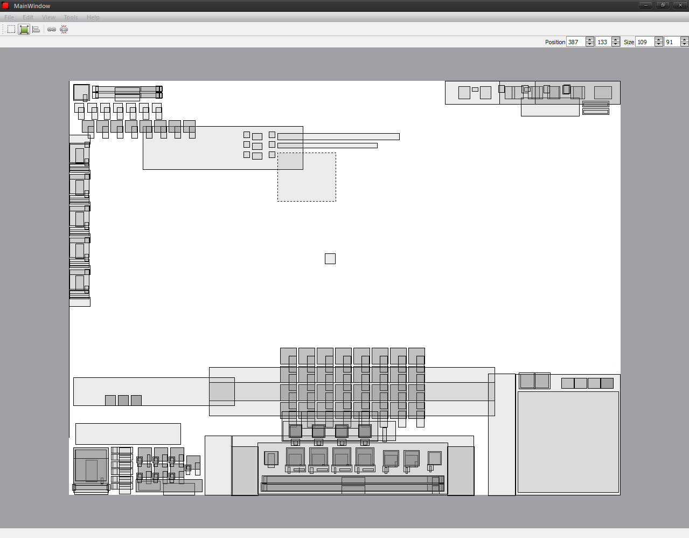
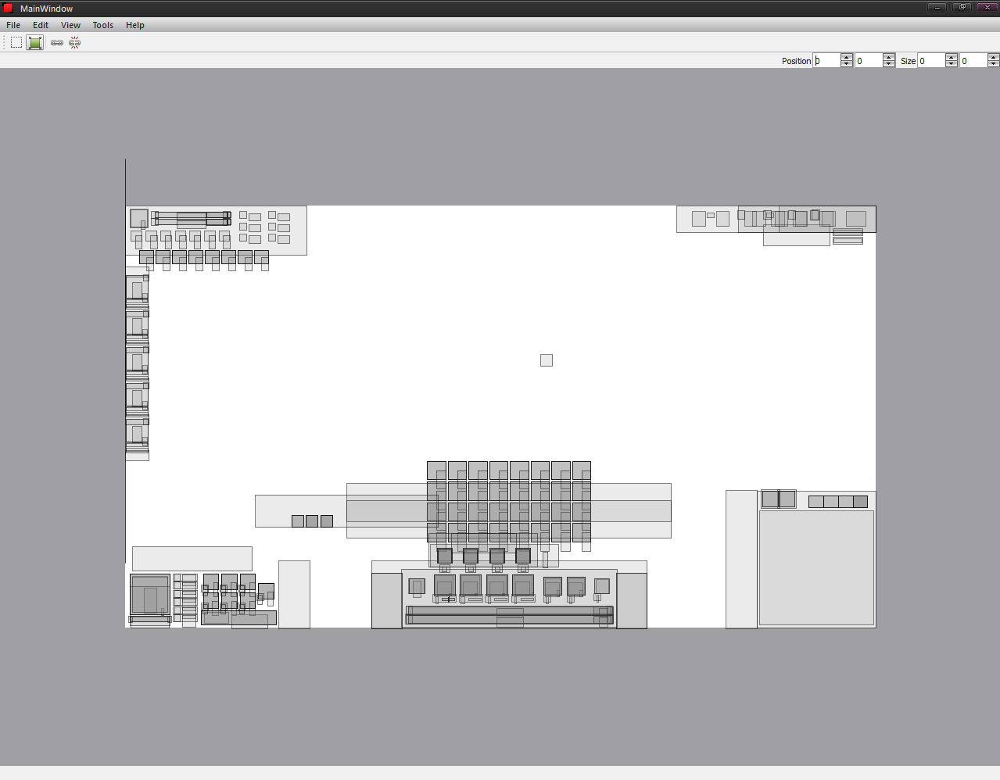
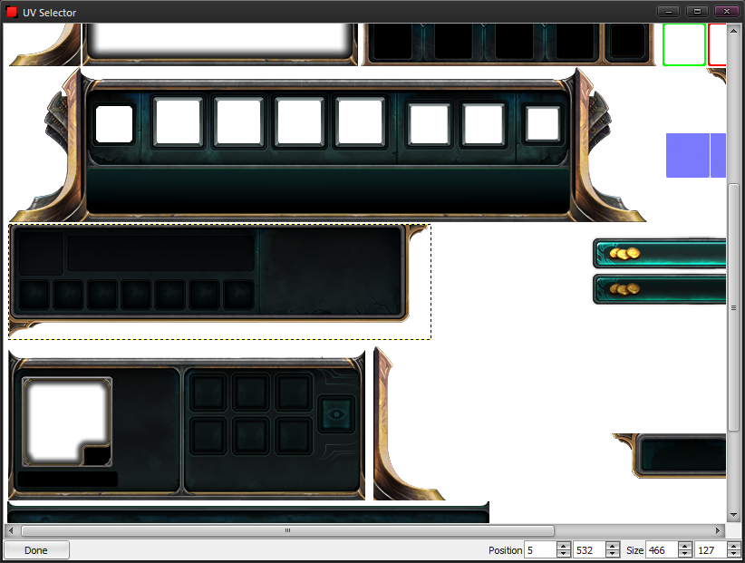

## HudEdit

### Description

After 2012 hud update, League of Legends HUD modding became hard-er-ish. There is over 650 elements in the files that had to be manually adjusted using a text editor. The positions are weirdly calculated, there are parameters involved and over all there are lots of not clear concepts. There isn't even a tutorial or an article about HUD editing.

HudEdit was a project that was aiming to fix the current state of LoL HUD modding, by giving easy to use tool in the hands of the modders.

The project is inactive, due to League of Legends HUD system keeping changing, and
the main US getting somehow bearable.

### Features

* Incremental file changes (what's not needed to change wont be changed)
* Group Elements for easier manipulation
* Rearange HUD elements positions
* Select UVs from Atlasses

### Previews

